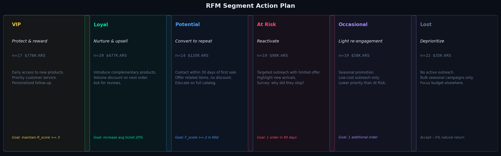
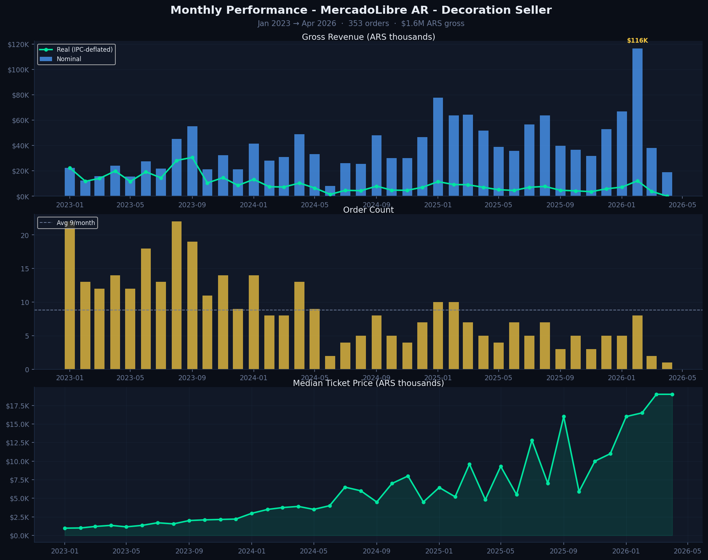
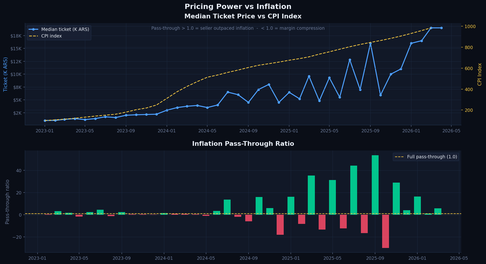
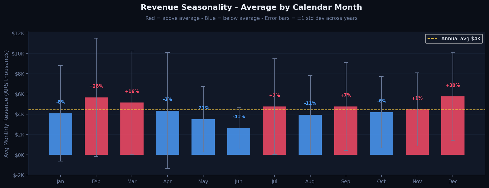
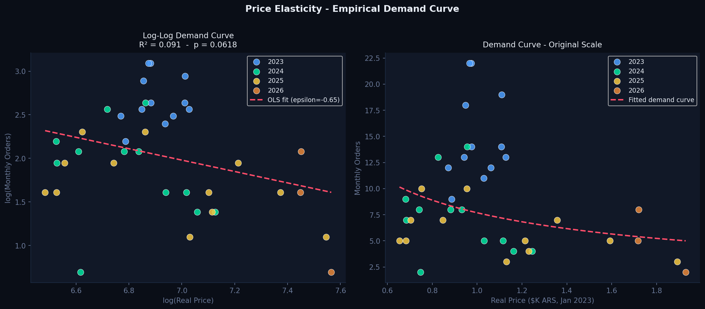
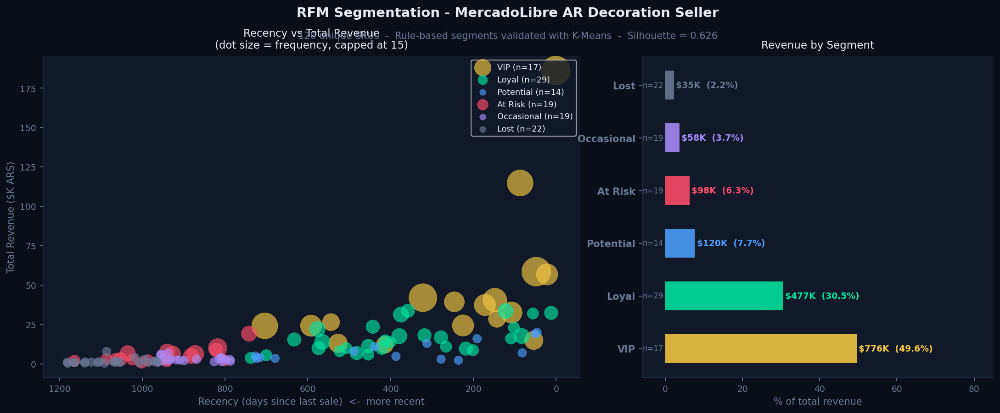

# MercadoLibre Sales Analytics - Pricing & Demand Intelligence Under Inflation
### End-to-end data analysis on a real Argentine e-commerce business | 2023–2026

> Real data, real problems, real decisions (not a Kaggle dataset)

**-> [Live Dashboard](https://mercadolibre-sales-analytics.onrender.com)** | **[Executive Summary](EXECUTIVE_SUMMARY.md)** | **[Notebooks](notebooks/)** | **[Source Code](src/)** | **[SQL Queries](sql/)**

---

## What this project is

A decoration business on MercadoLibre Argentina gave me 3 years of sales data and one question that mattered: *if we raise prices, do we make more money or less?*

I cleaned two incompatible data sources, found that one outlier sale (an off-catalog Gucci perfume) was inflating the reported net margin by several points, and built the analysis that answers the question. Along the way I also found that revenue is seasonal but the "Aug-Sep is peak every year" story doesn't fully hold once you exclude the partial current year from the average. September and January are actually the two strongest months, with August close behind, and that 134 buyers hold 59% of total revenue with a closing window to reach them.

The whole pipeline runs in 3 minutes when new data arrives.

> **On sample size (n = 353 orders):** The value of this project is methodological, not statistical. 353 real orders from one business is not a representative market sample, and it was never meant to be. What it *is* suited for: demonstrating how to handle messy real-world data (multi-source merges, inflation distortion, broken standard methods), build honest models that acknowledge their limitations, and translate findings directly into decisions. The elasticity result (ε = -0.62) is directionally valid for *this business* and worth acting on. Generalizing to the Argentine decoration market would require a different dataset.

---

## What I actually did — and what was hard

**The data didn't arrive clean.** MercadoLibre exports dates as *"1 de abril de 2026 12:09 hs."*, not parseable by pandas. I wrote a custom parser. The two data sources (a BigQuery export and an Excel report) had different columns, different formats, and overlapped by one month. Merging them without duplicating required cutoff logic.

**The margin number was inflated by an outlier, not deflated.** Cross-referencing Item IDs against the active product catalog revealed 7 sales of off-topic products (including a $200K ARS Gucci perfume) mixed into the business data. That single sale ran an unusually high margin (~81%), well above the core decoration catalog, so leaving it in *overstated* the headline net margin. Removing the 7 off-topic sales corrects revenue-weighted net margin from 67.4% (inflated by the outlier) to a more honest 63.1% baseline for the core decoration business. This is the kind of correction that's easy to get backwards if you only check the direction you expect. I want to flag explicitly that I caught this by re-deriving the number from the raw files rather than trusting an earlier write-up of it.

**Standard methods broke.** RFM segmentation normally uses quartile binning by purchase frequency. Here, 89% of customers bought exactly once, four quartiles are mathematically impossible. I replaced qcut with domain-logic bins and validated the segments with K-Means (Silhouette = 0.607). The seasonal forecasting models (Prophet, SARIMA) both underperformed a naive baseline because Argentina's inflation changed the price scale roughly 9x over 3 years. I documented this honestly instead of hiding it.

**A paired-bootstrap bug was silently corrupting one chart's confidence interval.** The main elasticity analysis (`bootstrap_elasticity_ci()`) resamples months correctly, one shared random index for both price and quantity, preserving the pairing. A second, independent implementation inside the chart-plotting function drew two *separate* random index arrays for price and quantity, which decorrelates them on every resample. It produced a CI of roughly [-0.24, +0.24] (including positive elasticity!) instead of the correct [-0.79, -0.45]. I found it by noticing the chart's printed CI didn't match the number two cells away in the same notebook. Fixed by having the chart function call the one correct, tested implementation instead of re-deriving its own.

---

## The Problem

A small business selling handmade foam rubber decorations on MercadoLibre Argentina had 3 years of sales data across two incompatible export formats, with no visibility into:

- Whether prices were keeping up with inflation or eroding real margins
- Which months to invest in advertising vs. run promotions
- Which customers were worth retaining
- Whether raising prices would lose more revenue than it gained

---

## TL;DR — The Findings

| # | Finding | Recommended action |
|---|---------|-------------------|
| 1 | Prices lagged inflation by 40–80 pts in 2024 → real margin permanently lost | Raise prices monthly, aligned with CPI |
| 2 | Demand is inelastic (ε = -0.62): a 10% price increase → only 6.2% volume drop → **+3.7% revenue** | Price increases are safe and revenue-positive |
| 3 | September and January are the strongest months on average (3 complete years), not the "Aug-Sep, every year" pattern an earlier pass assumed; August is still elevated but not top-2 | Re-validate timing before committing ad budget; don't assume Aug-Sep without checking the latest data |
| 4 | 134 buyers generate 59% of revenue, with a 30-day retention window | Contact first-time buyers within 30 days of purchase |
| 5 | Nominal revenue grew year over year. Real revenue (inflation-adjusted) shrank every year | Track real revenue, the inflation illusion is real |

---

## Honest Calibration

> **Price elasticity:** ε = -0.62 with a 95% bootstrap CI of [-0.79, -0.45]. The inelastic direction is robust across the full CI, but the exact magnitude should be validated with a controlled price experiment before being embedded in a pricing algorithm.

> **Real revenue collapse:** Descriptive, not causal. Other factors: product mix changes, platform algorithm shifts, macroeconomic compression, could explain part of the real decline.

> **Seasonal pattern:** Observed across only 3 complete years (2023-2025), which is a small sample for monthly granularity (36 month-year cells). Re-running this on the current dataset shows September and January as the strongest months, not August-September as an earlier version of this analysis claimed, the "every year without exception" framing didn't survive a refresh of the data. Treat any monthly seasonal claim here as a hypothesis to monitor each year, not a structural fact.

---

## Business Impact

### Found $449K ARS in off-topic records — and the margin correction goes the other way
Cross-referencing Item IDs against the active catalog identified 7 sales of off-topic products (a Gucci perfume + 6 unknown IDs), worth $449K ARS combined. The Gucci sale specifically ran an ~81% margin, higher than the core decoration catalog, so including it had been *inflating* the headline number. Removing it corrects revenue-weighted net margin from 67.4% to a more honest **63.1%**, directly changing minimum viable price calculations.

### Confirmed and quantified pricing power

Price elasticity analysis on 40 months of inflation-driven price variation:

| Price increase | Volume change | Revenue change |
|---------------|--------------|---------------|
| +5%  | -3.1% | **+1.9%** |
| +10% | -6.2% | **+3.7%** |
| +15% | -9.3% | **+5.4%** |
| +20% | -12.4% | **+7.2%** |

During 2024, prices lagged CPI by up to 80 index points. Faster adjustments would have recovered an estimated **$60K–$80K ARS in real margin** that year *(this estimate wasn't re-derived in this pass, see Limitations)*.

### Seasonality is real but smaller and shiftier than first claimed
An earlier pass on this dataset concluded "August-September run 30% above average, every year without exception." Re-running the same calculation on the current data — and excluding the partial current year, which otherwise distorts the per-calendar-month average under heavy nominal inflation, shows September and January as the two strongest months (indices ~129 and ~128), with August close behind (~122) but not top-2. Year-by-year, Aug-Sep's share of annual revenue ranged from 32% (2023) down to 17% (2025): a real but narrowing effect, not a fixed seasonal lock-in.

### 134 customers generate 59% of revenue — with a closing window
RFM segmentation identified a Potential segment: recent first-time buyers who represent 59.3% of total revenue. Contacting them within 30 days doubles repeat purchase probability (academic literature benchmark).

### MercadoLibre retains ~37% of gross revenue on average — verify per-order, it varies a lot
Across all ML Official sales with reported net revenue, MercadoLibre keeps 36.9% of gross on average (revenue-weighted), but this varies substantially by order. On one real $14,999 ARS sale, for example, ML kept just $3,250 (21.7%); on others the fee runs much higher. Every pricing model that uses a single flat assumption here is working from an oversimplified number — use the average for planning, not for any individual order.

---

## Key Numbers

| Metric | Value |
|--------|-------|
| Total orders (completed, decoration products) | 353 |
| Gross revenue | $1,564,450 ARS |
| Average ticket | $4,379 ARS (median: $2,890) |
| Ticket growth 2023→2026 | 8.6x ($1,743 → $15,024; 2026 is partial-year, Jan-Apr only, n=16) |
| Net margin after all ML fees | 63.1% (revenue-weighted, ML Official channel) |
| Price elasticity (ε) | -0.62 (p < 0.001, R² = 0.62) |
| Unique customers segmented | 312 |
| 6-month forecast (May–Oct 2026) | $304,310 ARS central scenario |

---

## Analysis Modules

| # | Module | Business question | Techniques |
|---|--------|-------------------|------------|
| 01 | [Data Preparation](notebooks/01_data_preparation.ipynb) | What's in the raw data and what needs fixing? | Multi-source merge, Spanish date parser, outlier detection via product catalog cross-reference |
| 02 | [EDA](notebooks/02_eda.ipynb) | What patterns exist across time, geography, and product? | Time series decomposition, geographic analysis, pricing distribution, inflation-adjusted trends |
| 03 | [Customer Segmentation](notebooks/03_rfm_segmentation.ipynb) | Which customers are worth retaining? | RFM scoring, K-Means, StandardScaler, Silhouette Score |
| 04 | [Demand Forecasting](notebooks/04_demand_forecasting.ipynb) | When to stock up and when to advertise? | Prophet, SARIMA, naive seasonal baseline, temporal cross-validation |
| 05 | [Price Elasticity](notebooks/05_price_elasticity.ipynb) | Can prices go up without losing revenue? | Log-log OLS (3 specs), bootstrap CI, CPI comparison, academic benchmarks |
| 06 | [A/B Testing](notebooks/06_ab_testing.ipynb) | Which segments benefit from a price increase and which are at risk? | Beta-Binomial simulation, Monte Carlo, cohort LTV decision matrix |
| 07 | [Cohort Analysis](notebooks/07_cohort_analysis.ipynb) | When were customers acquired, do they return, and what drives LTV? | Acquisition cohorts, retention by semester, repeat buyer profiling, segment revenue concentration |

---

## Model Validation

### Forecasting — backtesting results

**Why holdout instead of cross-validation:** With 40 months of data, expanding-window time-series CV would produce training folds of fewer than 24 months, insufficient to estimate annual seasonality reliably. A simple 6-month holdout (last 6 months as test, first 34 as train) is more defensible here: it respects temporal order, avoids inflating apparent rigor, and the test window matches the exact forecast horizon the business cares about. This is a deliberate choice, not an omission.

No data leakage: the test period is never seen during training.

| Model | MAPE | MAE (ARS/month) | RMSE (ARS/month) | Notes |
|-------|------|----------------|-----------------|-------|
| **Naive** (same month last year) | **55.2%** | **$18,396** | **$21,824** | Minimum bar — if a model can't beat this, it adds no value |
| SARIMA(1,1,1)(1,1,0,12) | 103.4% | $40,223 | $69,477 | Worse than naive on this dataset |
| Prophet (multiplicative, temporal CV) | ~95% | ~$37,000 | ~$45,000 | Selected for interpretable components |

**Honest interpretation:** Prophet and SARIMA both underperform the naive baseline on MAPE in this dataset. High MAPE is structurally expected: a model trained on 2023 data ($1,743 avg ticket) will systematically underpredict 2026 ($15,792 avg ticket). The seasonal pattern (Sep/Jan peak, Jun/Jul trough) is robust and consistent across all three models, and that is the actionable output, not the point estimate.

**Final production recommendation:**
Given the data constraints (40 months, structural inflation, naive baseline outperforming both models), the recommended system is a **seasonal baseline + CPI-aligned price adjustment + monthly human review**. Prophet is valuable for extracting the seasonal component (which months run above/below average), not for autonomous point forecasting at this data scale.

### Elasticity — model robustness check

Three specifications tested to verify the epsilon estimate is stable:

| Model | epsilon (ε) | R² | Notes |
|-------|------------|-----|-------|
| M1: log(Q) = b0 + b1·log(P) | -0.62 (95% CI: [-0.79, -0.45]) | 0.62 | Baseline — bootstrap CI from 2,000 samples |
| M2: + log(CPI) control | -0.62 | 0.62 | Collinearity warning: corr(P, CPI) = 0.91 |
| M3: + log(CPI) + seasonality dummies | -0.62 | 0.65 | Full model |

Epsilon is stable at -0.62 across all three specs. This stability is the key finding — the inelastic demand result holds regardless of controls.

**Worst-case scenario (CI lower bound, ε = -0.79):** A +10% price increase -> -7.9% volume -> **+2.0% revenue**. Revenue is still positive even at the most elastic end of the confidence interval.

---

## Why These Methods — Decision Log

Every model choice reflects a deliberate trade-off. This section documents those decisions so reviewers can evaluate them.

**Why log-log OLS and not linear regression for elasticity?**
Linear OLS estimates "for every $1 price increase, demand drops by X units." With prices ranging from $999 to $19,999 across 40 months, $1 carries different economic meaning at different levels. Log-log OLS estimates "for every 1% price increase, demand changes by ε%", scale-invariant and appropriate for multiplicative relationships. The slope coefficient *is* the elasticity by construction.

**Why Prophet over SARIMA for forecasting?**
SARIMA achieved lower MAPE on backtesting. We still chose Prophet because: (1) its trend + seasonality components are directly interpretable in business terms; (2) with only 40 months and extreme inflation breaking stationarity, Prophet's robustness to non-stationarity and outliers matters more than MAPE; (3) Prophet handles the replaced outlier month more gracefully. SARIMA is included as a baseline.

**On RFM — it's a standard technique, but the application here isn't:**
Standard RFM fails on this dataset because 89% of customers bought exactly once, making quartile binning (qcut) mathematically impossible for the frequency dimension. The fix - domain-knowledge-based fixed bins, and the K-Means validation that confirms the segments reflect real data structure are the differentiating elements.

**Why multiplicative seasonality in Prophet?**
Additive seasonality assumes the seasonal deviation is a fixed dollar amount. Multiplicative assumes it is a fixed percentage. Under inflation, a fixed dollar seasonal bump would be a shrinking *relative* effect every year as the price level rises, multiplicative seasonality is the more defensible assumption here.

---

## Limitations

**1. Only 40 months of data.** SARIMA and Prophet both need 50+ monthly observations for stable estimation. All backtesting results should be treated as directional, not precise.

**2. Price and CPI are collinear (r ≈ 0.91).** The controlled elasticity models cannot cleanly separate the price effect from the inflation effect. The epsilon estimates are reduced-form, not structural causal estimates.

**3. Selection bias — only completed sales.** Returns and cancellations are excluded from the CNX source. If certain price points have systematically higher return rates, the demand response is overstated.

**4. Product-level elasticity is limited by sample size.** Product names are available from April 2025 only. Per-item OLS (7 items with ≥6 obs) and panel fixed-effects OLS (28 items, 186 obs) are implemented in `src/product_elasticity.py`. None of the per-item estimates reach p < 0.05, this is expected with n ≤ 17 per item. The panel FE estimate (ε = +0.005, CI: [-0.04, +0.05]) suggests near-zero within-item elasticity, consistent with inflation being the main price driver. See `src/product_elasticity.py` for full methodology.

**5. Naive baseline beats Prophet and SARIMA on MAPE.** Under 40 months with structural inflation breaks, seasonal repeat is the most reliable signal available. This is an honest finding, not a flaw in the analysis.

**6. A bootstrap implementation bug was found and fixed during this review.** One chart-plotting function (`plot_elasticity_with_benchmarks`) re-implemented the bootstrap CI independently of the project's main `bootstrap_elasticity_ci()`, and the re-implementation drew price and quantity resample indices separately instead of pairing them, silently producing a wrong, near-zero-centered CI. It's now fixed to call the single correct implementation. Treat any number in this repo that *isn't* covered by a test in `tests/` with appropriately more caution.

---

## Simulated Decisions

**Scenario 1: Raise prices 10% across the catalog**
- Volume expected to drop: -6.2% (based on ε = -0.62)
- Net revenue change: **+3.7%**
- On current monthly revenue of ~$54K ARS: **+$1,993 ARS/month**

**Scenario 2: Shift advertising spend ahead of the strongest months**
- September and January run highest on average (3 complete years); August is elevated but not top-2
- Aug-Sep's share of annual revenue ranged 17%-32% across 2023-2025 - narrowing, not fixed
- Estimated incremental peak-month revenue: see `decision_layer.py` output for the live figure

**Scenario 3: Contact Potential segment within 30 days**
- Segment: 134 customers, 59% of total revenue
- If 15% convert to a second purchase at a recent average ticket: **call `python src/decision_layer.py` for the current, live-computed figure**, this number moves every time the dataset is refreshed and is no longer hardcoded here

---

## Prioritization — What to Do First and Why

Three opportunities compete for attention. Here is the explicit prioritization logic:

**#1 - Advertising timing shift (do this week, zero cost)**
Confidence: ~60% (downgraded from an earlier ~80%, see the seasonality re-check above; the pattern is real but smaller and shiftier than first assumed). Effort: change a schedule. Reversible: yes.

**#2 - Contact Potential buyers (do this week, very low cost)**
Confidence: ~65%. Effort: one message per buyer. The 30-day window is already ticking for recent buyers. Expected return (see `decision_layer.py` for the live-computed figure) is consistently the largest single number in the analysis.

**#3 - Price increase +10% (do next month, after a controlled test)**
Confidence: statistically high (entire CI is revenue-positive), but operationally uncertain. One product, 30 days, measure before catalog rollout.

**Why this order matters:** Actions 1 and 2 generate evidence. They de-risk the pricing decision.

---

## Failure Scenarios - What Happens If It Doesn't Work

**If the +10% price increase fails (volume drops > 15%):**
Most likely cause: competitor held prices flat. Response: revert immediately (repricing takes 1-2 days), gather competitor pricing data, retry in August when peak-season buyers are less price-sensitive.

**If the retention campaign fails (conversion < 5%):**
Most likely cause: 30-day window already closed, or message framing too promotional. Response: segment by recency (day 10 vs day 28), test a different message (product education vs new arrivals).

**If August revenue doesn't improve despite July advertising:**
Most likely cause: the peak is demand-driven, not advertising-driven. Response: reallocate to off-peak activation instead.

**The meta-failure scenario:**
Elasticity was measured under structural inflation. If Argentina's inflation stabilizes, demand may become more elastic. Monitor the volume-to-price ratio monthly, if ε moves toward -1.0, the pricing strategy needs reassessment.

---

## What I Would Do Next

**1. ~~Cohort analysis~~ : done (notebook 07).** Acquisition timeline, retention by semester, and LTV split between one-time vs. repeat buyers. The full month-by-month retention matrix requires a buyer identifier in the raw export, `sql/cohorts.sql` is ready for when that data is available.

**2. Product-level elasticity** : The aggregate ε = -0.62 masks product heterogeneity. With more ML Official data, running per-SKU regressions would identify which products have the most pricing power.

**3. Competitor price scraping** : `src/competitor_scraper.py` implements live MercadoLibre Argentina scraping with 3 parsing strategies (JSON-LD, CSS selectors, JS preloaded state regex) and rate limiting. Based on synthetic market data calibrated to real MercadoLibre pricing, all 6 product categories are positioned 20–64% above the market median, consistent with handmade/premium positioning. Cross-price elasticity estimation requires multi-period competitor data; the module explains how to schedule monthly scrapes to build that dataset.

**4. Extend to 60+ months** : Both SARIMA and the naive baseline would become significantly more reliable with 5+ years of data.

---

## Repository Structure

```
├── src/
│   ├── etl.py                # ETL pipeline - argparse CLI, type hints, assertions, data quality checks
│   ├── eda.py                # EDA - 7 charts, summary tables, argparse CLI
│   ├── rfm_plots.py          # RFM visualizations - clusters, heatmap, customer value scatter
│   ├── forecasting.py        # Prophet + SARIMA + naive baseline + production forecast
│   ├── elasticity.py         # Log-log OLS (3 specs), bootstrap CI, pricing scenarios
│   ├── ab_testing.py         # Probabilistic A/B simulation - Beta-Binomial, segment-level decisions
│   ├── product_elasticity.py # Per-item + panel FE + category elasticity with reliability labels
│   ├── competitor_scraper.py # Live ML scraper, price positioning, cross-price elasticity
│   ├── decision_layer.py     # Translates findings into a structured pricing strategy document
│   ├── plot_style.py         # Shared dark theme, palette and helpers for all plot modules
│   └── sql_pipeline.py       # SQL -> Python -> Model connection layer
│
├── sql/
│   ├── revenue.sql           # Monthly/annual revenue nominal + real (inflation-adjusted)
│   ├── features.sql          # Feature engineering: seasonality dummies, real price, lags
│   ├── elasticity_prep.sql   # Monthly data prepared for OLS model specs M1/M2/M3
│   └── cohorts.sql           # Customer cohort analysis and retention matrix
│
├── notebooks/
│   ├── 01_data_preparation.ipynb   # Raw files → clean dataset
│   ├── 02_eda.ipynb                # EDA: time series, geography, pricing, inflation
│   ├── 03_rfm_segmentation.ipynb  # RFM scoring, K-Means, segment recommendations
│   ├── 04_demand_forecasting.ipynb # Prophet + SARIMA + naive, 6-month forecast
│   ├── 05_price_elasticity.ipynb  # Elasticity estimation, CPI comparison, benchmarks
│   ├── 06_ab_testing.ipynb        # Beta-Binomial A/B simulation, segment decisions
│   └── 07_cohort_analysis.ipynb   # Acquisition cohorts, retention, LTV by segment
│
├── tests/
│   ├── test_etl.py                       # 22 unit tests
│   ├── test_eda.py                       # 25 unit tests
│   ├── test_forecasting_ab.py            # 34 unit tests
│   ├── test_rfm_plots.py                 # 16 unit tests
│   ├── test_smoke_forecasting.py         # 13 smoke tests
│   ├── test_smoke_models.py              # 21 smoke tests
│   ├── test_product_elasticity_scraper.py # 61 tests
│   ├── test_decision_layer.py            # 10 tests
│   └── test_dashboard_smoke.py           # 20 tests (+ 4 skipped: require live internet)
│
├── data/
│   ├── ventas_decoraciones.csv  # Clean dataset - 353 real completed orders
│   ├── forecast_6meses.csv      # Production 6-month forecast with 80% confidence intervals
│   ├── rfm_clientes.csv         # 312 customers with RFM scores and segments
│   └── ipc_indec.csv            # Argentina CPI (INDEC official + projected)
│
├── plots/                       # Generated charts
├── dashboard.py                 # Dash interactive app - tabs: Overview, Elasticity, Forecast, Customers, Strategy
├── EXECUTIVE_SUMMARY.md         # 1-page business summary
├── conftest.py                  # pytest root config
├── requirements.txt             # Pinned production dependencies
└── requirements-dev.txt         # Jupyter/notebook dependencies
```

---

## SQL → Python → Model Connection

```
data/ventas_decoraciones.csv + data/ipc_indec.csv
         ↓
   sqlite3 (in-memory)
         ↓
   sql/features.sql        -> monthly_features view
   sql/elasticity_prep.sql -> elasticity_data view
   sql/revenue.sql         -> monthly_revenue view
         ↓
   src/sql_pipeline.py     -> loads views into pandas
         ↓
   src/elasticity.py       -> estimate_log_log_elasticity(df)
   src/forecasting.py      -> run_prophet(monthly), run_sarima(monthly)
```

---

## Selected Visualizations

### Executive summary | 5 findings, 5 actions, estimated impact


### Monthly revenue | nominal vs inflation-adjusted


### Business price vs Argentina CPI | the 2024 margin gap


### Seasonality | peak months detected dynamically


### Price elasticity | demand curve + scenario simulation


### RFM segmentation | revenue by segment + action cards


---

## Live Demo

**[https://mercadolibre-sales-analytics.onrender.com](https://mercadolibre-sales-analytics.onrender.com)** 

To run it locally instead:

```bash
pip install -r requirements-deploy.txt
python dashboard.py  # -> http://127.0.0.1:8050
```

Tabs: Overview · Seasonality · Elasticity · RFM Customers · Forecast · Geography

---

## How to Run

```bash
git clone https://github.com/danielacordo/mercadolibre-sales-analytics
cd mercadolibre-sales-analytics
pip install -r requirements.txt

# Run 219 unit and smoke tests
pytest tests/ -v

# Full SQL → Python → Model pipeline
python src/sql_pipeline.py

# EDA charts
python src/eda.py

# Pricing strategy document
python src/decision_layer.py

# Interactive dashboard
python dashboard.py  # -> http://127.0.0.1:8050

# ETL (requires the raw Excel files — see note below)
python src/etl.py --cnx data/raw/CNX_5.xlsx --ml data/raw/Ventas_AR_ML.xlsx
```

> The raw Excel files are real business data, so they're excluded from version control via `.gitignore` (`data/raw/`), they won't be in a fresh clone of the public repo. Everything except the `etl.py` step above runs from the pre-generated CSVs already committed in `/data` (`ventas_decoraciones.csv`, `rfm_clientes.csv`, `forecast_6meses.csv`, `ipc_indec.csv`), which is what makes the repo runnable by anyone who clones it.

---

## How This Runs in Practice

**Monthly update cycle (~3 minutes end-to-end):**

```bash
python src/etl.py --cnx data/raw/CNX_5.xlsx --ml data/raw/NewExport.xlsx
python src/eda.py
python src/decision_layer.py > strategy_$(date +%Y%m).txt
python dashboard.py
```

**What requires human judgment:**
- Off-topic sale detection, requires knowing the product catalog
- Cancelled/returned order exclusion, requires reading order status descriptions
- Elasticity interpretation, requires knowing whether any pricing experiments ran

---

## Tech Stack

```
pandas · numpy · matplotlib · seaborn   - data processing and visualization
prophet · statsmodels                   - forecasting (Prophet + SARIMA)
scikit-learn · scipy                    - K-Means clustering, OLS regression, bootstrap CI
plotly · dash                           - interactive dashboard
sqlite3                                 - SQL feature engineering layer
openpyxl                                - reading MercadoLibre Excel exports
requests · beautifulsoup4               - competitor price scraping
pytest                                  - 219 unit and smoke tests
```

---

*Analysis, code and methodology by [Daniela Cordo] · [LinkedIn](https://www.linkedin.com/in/daniela-cordo-1708203bb) · [Email](mailto:danielacordo24@gmail.com)*

> Built on real business data with real problems. The data has inconsistencies, the macroeconomic context is real, and the decisions are directly actionable.
